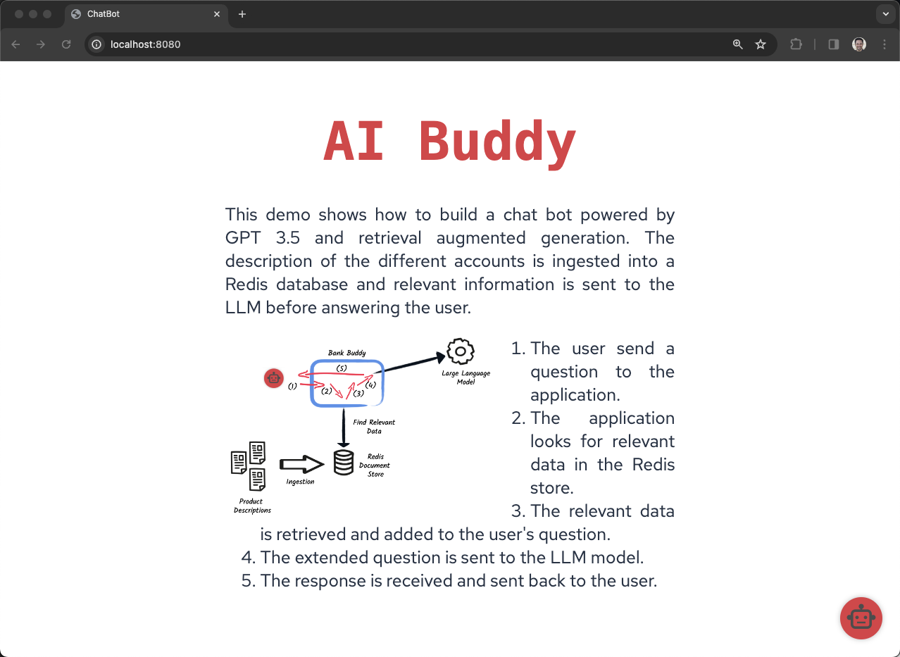

# langchain4j-demo

This example leverages a LLM + RAG (Retrieval Augmented Generation), where additional context, additional private data is loaded and is additive to the prompt provided to the LLM.

## Setup

Go to https://openai.com/blog/openai-api

Sign up

Create an API key https://platform.openai.com/api-keys

Provide a credit card for Billing https://platform.openai.com/account/billing/overview

Monitor usage https://platform.openai.com/usage

Create a .env file in the root of the project to hold the API key

```
QUARKUS_LANGCHAIN4J_OPENAI_API_KEY=<insert openai.com API key here>
```

## Running the application in dev interactive mode
You can run your application in dev mode that enables live coding using:
```shell script
./mvnw compile quarkus:dev
```

```
open http://localhost:8080
```



## Interacting with the application

Example questions for the Bank

**what are the different types of accounts?**

**what is the minimum deposite for each?**

**what are the fees for each?**

Example questions for the Museum

**please describe youre exhibitions**

**what is the minimum size for a youth group visit**

**what were the inspirations for Elijah Montrose?**

Example questions for the grocery store

**what food should I eat?**

Example questions for the Insurance company

**what policies do you offer?**

**does the silver elite require a medical exam?**

**Are high risk activities not covered by the 20-year term?**

**Are high risk activities not covered by the silver elite 30-year term?**


## Parts

**Bot.java** provides the name for the AI

**IngestorExample.java** handles the sucking in of the resources/catalog/*.txt files as additional data to inform the LLM.  "bank" and "museum" are two options to contextualize the AI.

**RetrieverExample.java** handles the merging of this additional data into the prompt that is sent to the LLM

To see this additional prompt, turn on logging 

application.properties

```
quarkus.langchain4j.openai.log-requests=true
```


> **_NOTE:_**  Quarkus now ships with a Dev UI, which is available in dev mode only at http://localhost:8080/q/dev/.

## Packaging and running the application

The application can be packaged using:
```shell script
./mvnw package
```
It produces the `quarkus-run.jar` file in the `target/quarkus-app/` directory.
Be aware that it’s not an _über-jar_ as the dependencies are copied into the `target/quarkus-app/lib/` directory.

The application is now runnable using `java -jar target/quarkus-app/quarkus-run.jar`.

If you want to build an _über-jar_, execute the following command:
```shell script
./mvnw package -Dquarkus.package.type=uber-jar
```

The application, packaged as an _über-jar_, is now runnable using `java -jar target/*-runner.jar`.

## Creating a native executable

You can create a native executable using: 
```shell script
./mvnw package -Dnative
```

Or, if you don't have GraalVM installed, you can run the native executable build in a container using: 
```shell script
./mvnw package -Dnative -Dquarkus.native.container-build=true
```

You can then execute your native executable with: `./target/langchain4j-demo-1.0.0-SNAPSHOT-runner`

If you want to learn more about building native executables, please consult https://quarkus.io/guides/maven-tooling.

